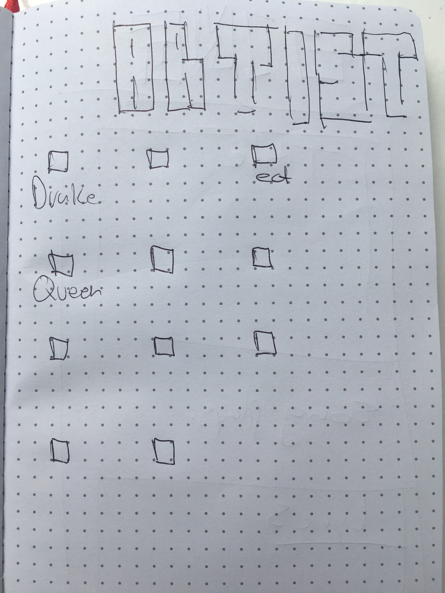

# karaoke

I want to create an app that gives a user options of what kind of genre, artist, bpm or feeling they want to sing. Take that information and fetch the song through Spotify's API while also fetching information from API seed (a lyric fetching API) then render the lyrics and song on the page. 

Spotifys Docs
https://developer.spotify.com/documentation/

STYLE 
Try make it look like a karaoke bar using P5 
install wrapper 
https://www.npmjs.com/package/react-p5-wrapper
also use Bulma if needed 
https://alligator.io/react/intro-react-bulma-components/

GET LYRICS
https://orion.apiseeds.com/api/music/lyric/:artist/:track

key is in env file 

Difficulties...
Getting the lyrics to display on the screen while the music is playing? 
might not be possible 

Taking all the user input and searching through the data to find matching songs then being able to match that song with lyrics.

Will it be possible to send in the BPM as a searchable paramater?

Learning how to use P5 for styling.

