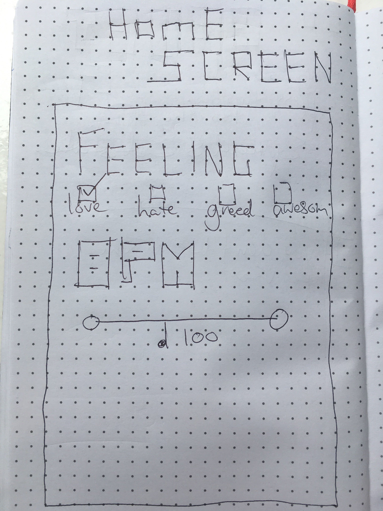

# karaoke

I want to create an app that gives a user options of what kind of genre, artist, bpm or feeling they want to sing. Take that information and fetch the song through Spotify's API while also fetching information from API seed (a lyric fetching API) then render the lyrics and song on the page. 

