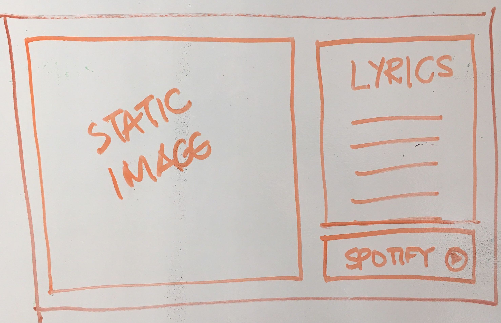

# Karaoke 

Create an app that gives a user options of what kind of genre, artist, bpm or feeling they want to sing. Take that information and fetch the song through Spotify's API while also fetching information from API seed (a lyric fetching API) then render the lyrics and song on the page. 

## Objective

Getting lyrics to display on the screen while the music is playing.
Taking all the user input and searching through the data to find matching songs then being able to match that song with lyrics.
Map the tempo 
Learning how to use P5 for styling.
Use Oauth 2 for Spotify authentification.
Use reacte router to navigate between pages.
Would love to be able to implement this with slack so people can recommend songs from slack
Use provider to help manage state
Use cors anywhere to solve a network rejection issue

### The Reality

Used minimum styling and focussed on functionallity. 
Had to move to the YouTube API because of authentification issues with the Spotify API

### Future Development

Revisit with the Spotify API 
Try to get the searching by feeling functionality working.

### Recources

Spotifys Docs
https://developer.spotify.com/documentation/

STYLE 
karaoke bar inspo
use P5 
install wrapper 
https://www.npmjs.com/package/react-p5-wrapper

Bulma 
https://alligator.io/react/intro-react-bulma-components/

GET LYRICS
https://orion.apiseeds.com/api/music/lyric/:artist/:track

& musixMatch

